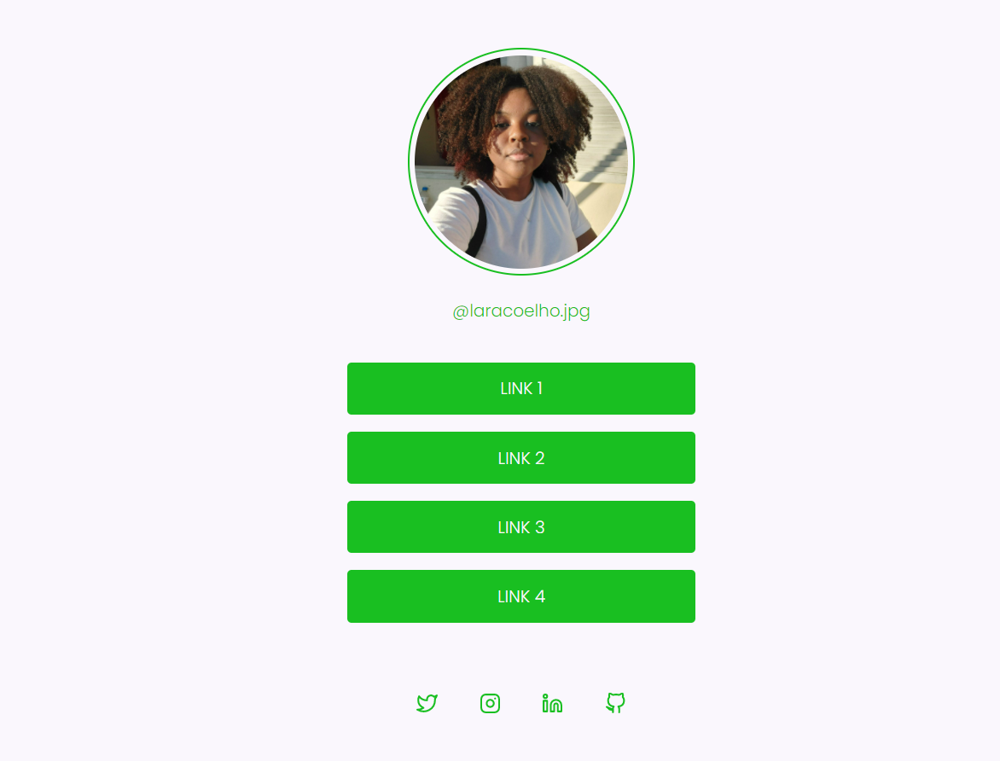

# Desafio "Social Tree"

Desafio proposto pela Rocketseat, onde eu deveria criar uma página com uma lista de links (menu) que pode ser usada em perfis de redes sociais para direcionar o usuário para o local escolhido. Utilizando HTML e CSS

## Link do projeto final
https://htmlpreview.github.io/?https://github.com/laoak/Social-Tree/blob/main/index.html

## 👾 Tecnologias
- [HTML](https://developer.mozilla.org/pt-BR/docs/Web/HTML)
- [CSS](https://developer.mozilla.org/pt-BR/docs/Web/CSS)

## Layout do projeto final

